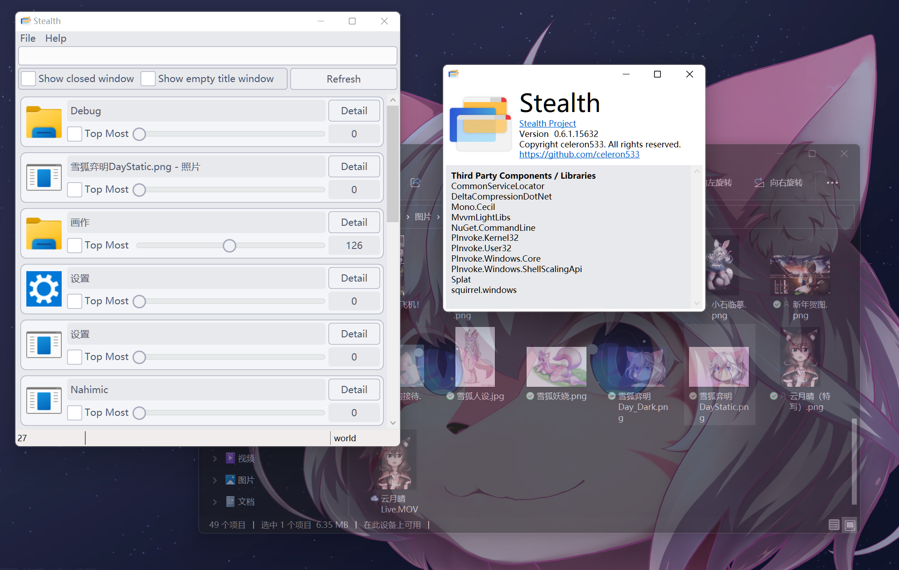

# Stealth

A tool to change window's opacity attribute on Windows Vista and above.\
This is a tiny personal project for .Net coding practice.

## Features
- Set target window transparency
- Set target window as pin-on-top
- List all visible windows
- Filter: show modified windows only
- Filter: hide removed windows
- Filter: on window title

## Screenshots (v0.6.2)
Thanks to [Symin](https://github.com/syminomega) provides new icon, UI sytle and screenshots.

## License
[GNU GENERAL PUBLIC LICENSE (GPL)](./LICENSE)\
(Any further development based on this code should be open-sourced)