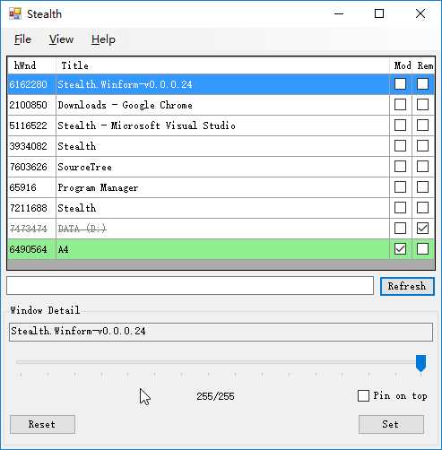
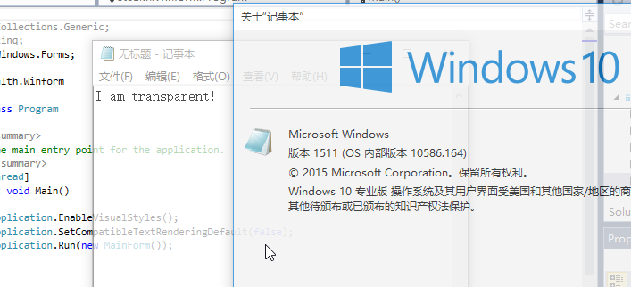

Stealth
=======

A tool to change window's opacity attribute on Windows Vista and above.  
This is a tiny personal project for .Net coding practice.  
  
Develop branch build status:  

Features:
- Set target window's transparency
- Set target window's as pin-on-top
- List all visible windows
- Filter: show modified windows only
- Filter: hide removed windows
- Filter: on window's title

Note:
* If the window is created before Stealth, you may unable to set the pin-on-top properity.

Screenshots
==========

License
=======
GPL.  
(Any further development based on this code should be open-sourced)
