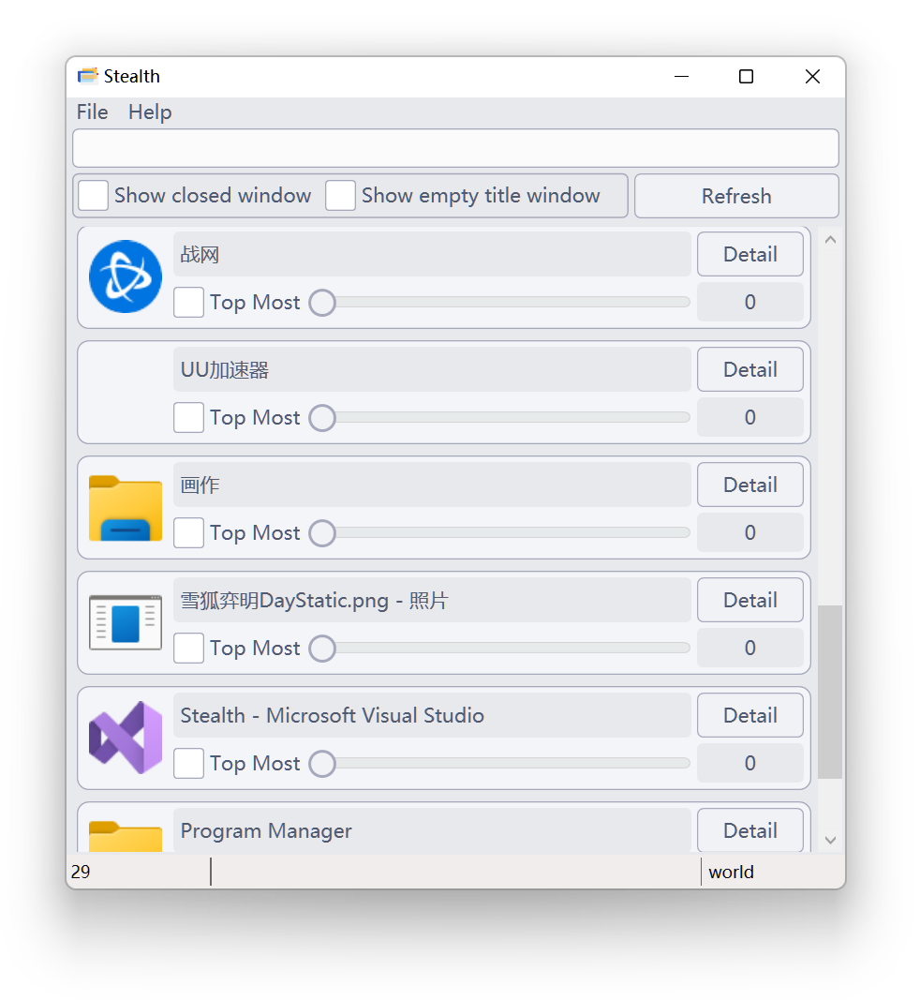

# Stealth

A tool to change window's opacity attribute on Windows Vista and above.  
This is a tiny personal project for .Net coding practice.  

## Features
- Set target window transparency
- Set target window as pin-on-top
- List all visible windows
- Filter: show modified windows only
- Filter: hide removed windows
- Filter: on window title

## Screenshots

## License
GPL.  
(Any further development based on this code should be open-sourced)